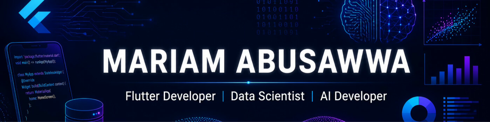
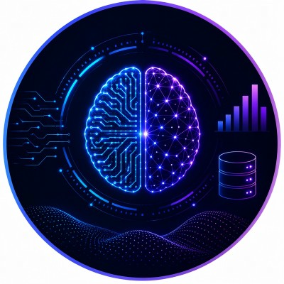

<div align="center">






[](https://www.linkedin.com/in/mariam-abusawwa-ba935030b/)
[](https://github.com/mariamsawwa12)


</div>

## About Me

I am a **Data Scientist, AI Developer, and Flutter Developer** based in Jordan, with an academic background in Data Science and Artificial Intelligence at **Al al-Bayt University**. I build end-to-end projects that move from data exploration and model development to practical, user-facing mobile applications.

My work spans three complementary areas: building complete Flutter applications, integrating mobile clients with Backend and AI services, and developing machine-learning workflows that can move beyond notebooks into usable products.

- Experienced in Flutter development, Firebase services, REST API integration, state management, localization, and responsive mobile UI
- Hands-on with data cleaning, EDA, feature engineering, classification, regression, model evaluation, and hyperparameter tuning
- Completed **130 hours of hands-on Mobile Application Development with Flutter training at DOT Jordan**
- Currently developing deeper skills in **AI Agents, NLP, Computer Vision, and Advanced Deep Learning**

## Core Focus

| Data Science & AI | Flutter Development | Intelligent Applications |
| --- | --- | --- |
| Data analysis, feature engineering, classification, regression, and evaluation | Cross-feature mobile apps using Provider, Firebase, REST APIs, and local persistence | TensorFlow Lite deployment, AI-service integration, voice, camera, and data-driven UX |

## Technical Skills

### Data Science & Machine Learning

<p>


</p>

**Applied skills:** EDA · Data Cleaning · Feature Engineering · Classification · Regression · Model Evaluation · Cross-Validation · Hyperparameter Tuning · Imbalanced Classification

### Flutter & Mobile Development

<p>


</p>

**Applied skills:** Provider & ChangeNotifier · BLoC · GetX · Firebase Authentication · Cloud Firestore · Storage · FCM · SharedPreferences · Localization · Arabic RTL · Responsive UI · Camera · Audio · Speech-to-Text · Media Integration

## Featured Projects

The projects below represent three complementary strengths: independent Flutter development, large team-based integration, and end-to-end AI deployment.

<table>
<tr>
<td width="33%" valign="top">

### [Mova](https://github.com/mariamsawwa12/mova_app)

**Independent Flutter Project**

A feature-rich movie discovery application that demonstrates full ownership of the mobile experience.

- TMDB discovery and search
- Advanced genre, year, rating, and popularity filters
- Movie details, cast, trailers, and similar titles
- Firebase authentication and user services
- Watchlist, watch history, and notifications
- English/Arabic localization and RTL
- Persistent light and dark themes

**Flutter · Provider · TMDB · Firebase**

</td>
<td width="33%" valign="top">

### [Alpha](https://github.com/mariamsawwa12/alpha-financial-app)

**Team & Integration Project**

A large AI-assisted financial application demonstrating collaboration and integration across Flutter, Backend, and AI teams.

- Multi-step financial onboarding
- Authentication and OTP flows
- Expenses, goals, planning, and financial cycles
- Receipt, voice, chatbot, and analysis experiences
- Provider-based state management
- REST API integration
- Localization, RTL, and theming

**Flutter · Provider · REST APIs · Mobile Integrations**

</td>
<td width="33%" valign="top">

### [StudyMate](https://github.com/mariamsawwa12/studymate-showcase)

**AI + Mobile Project**

An intelligent academic application demonstrating the complete path from model development to on-device Flutter inference.

- Custom neural-network regression model
- TensorFlow Lite conversion and deployment
- Firebase authentication and prediction history
- Performance insights and personalized study guidance
- Provider state management
- English/Arabic localization and RTL

**Flutter · TensorFlow Lite · Firebase · Provider**

</td>
</tr>
</table>

> **Contribution clarity:** Mova and StudyMate are independent projects. Alpha is a multidisciplinary team project; my contribution focused on the Flutter application, state management, REST integration, mobile workflows, localization, and user experience. Backend and AI services were developed by other team members.

### Data Science & Machine Learning Projects

| Project | Workflow & Result |
| --- | --- |
| [Telco Customer Churn Prediction](https://github.com/mariamsawwa12/telco-customer-churn-prediction) | Business-focused imbalanced classification with leakage-aware splitting, EDA, feature engineering, five-model comparison, GridSearchCV, and held-out evaluation. Logistic Regression achieved a test F1-score of **0.5656**, with recall documented as the main improvement area. |
| [Student Grade Prediction](https://github.com/mariamsawwa12/student-grade-prediction) | TensorFlow regression experiment covering preprocessing, neural-network training, dropout, early stopping, hyperparameter comparison, baseline evaluation, and model export. It formed the experimental foundation for StudyMate's separate mobile-oriented model. |

## What Sets My Work Apart

```text
Data & Problem Understanding
            ↓
Model Development & Evaluation
            ↓
Mobile Deployment / API Integration
            ↓
Usable Flutter Product Experience
```

Across my portfolio, I demonstrate both depth and range: **Mova** shows independent Flutter ownership, **Alpha** shows collaboration and complex service integration, and **StudyMate** shows how I connect model development with a usable mobile product.

## Currently Developing

- AI Agents and intelligent workflows
- Natural Language Processing
- Computer Vision
- Advanced Deep Learning

These are active learning areas and are not presented as completed specializations.

## Education & Training

- **Data Science & Artificial Intelligence — Al al-Bayt University**
- **Mobile Application Development with Flutter — DOT Jordan**
  - Completed 130 hours of hands-on training covering Flutter and Dart, Firebase, REST APIs, Provider and BLoC, localization, theming, Git, AI integration, notifications, application structure, and deployment

## Connect

<div align="center">

[](https://www.linkedin.com/in/mariam-abusawwa-ba935030b/)
[](https://github.com/mariamsawwa12)

</div>

---

<div align="center">

### Turning data and intelligent models into practical mobile experiences.

</div>
